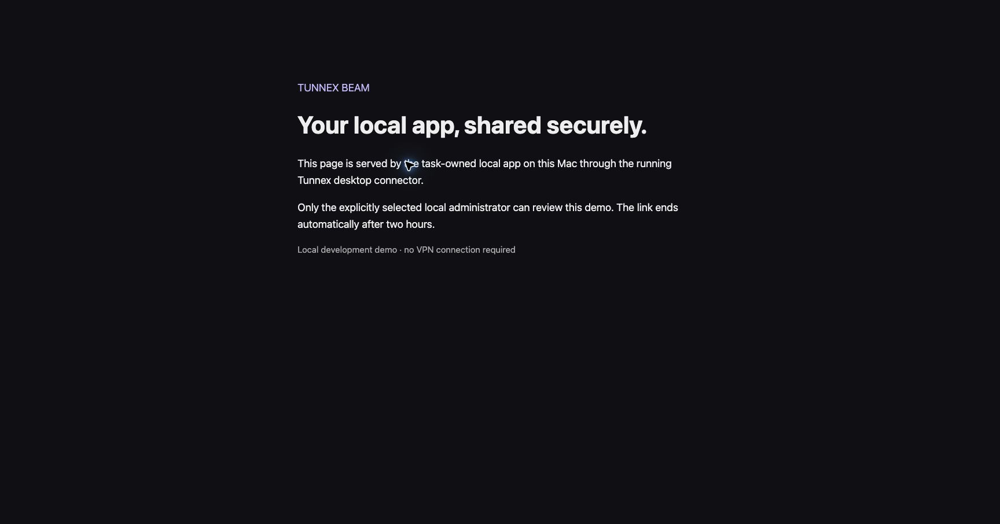

# Tunnex Beam local qualification

**Historical 2026-10-06 record.** See [2026-10-07 epic acceptance](BEAM-epic-acceptance-20261007.md) for the complete 31-case run, current full-suite counts, fresh package verification and authenticated AWS browser HMR/expiry/stop proof. Remaining release acceptance is listed there; the dated observations below are retained.

Recorded: 2026-10-06. Scope: uncommitted `extra-feature` worktrees at
`/private/tmp/tunnex-beam-plan` and `/private/tmp/tunnex-client-beam`.
No commit, push, release or production deployment is included.

The later standalone CLI extension is recorded separately below. It does not
close the outstanding browser/platform/deployment acceptance of the 11 stories.

The 11 stories and 31 slices have local implementation. A slice having passing
tests does not close its parent story when its browser, platform or deployment
acceptance is still outstanding. This record supplements the epic's original
UI/frontend/backend task tables and keeps their acceptance criteria intact.

## Slice evidence and remaining acceptance

| Slice | Local implementation and evidence | Remaining acceptance |
| --- | --- | --- |
| BM-0a | Separate Beam authority/transport contract, permission and source-credential boundaries, fixed targets, numeric limits and role journeys; **locally accepted** | Subsequent delivery acceptance belongs to later stories |
| BM-0b | Real Electron main/preload/renderer, normal CP PKCE, HTTP/SSE/WebSocket, invalid identity denial; native nonroot TLS TCP 443; macOS/Windows package contents; actual authenticated reviewer HTML with VPN disconnected; **locally accepted** | Native Windows runtime and public certificate checks remain BM-10 |
| BM-1a | Persistent versioned installation registry; five independent real DNS/TLS probes; operator readiness form; stale proof and domain withdrawal deny admission | Public certificate and deployed topology qualification belongs to delivery checks |
| BM-1b | Default-off organization policy, delegated audience, current membership/group constraints, atomic TTL and quota enforcement; approved admin-only fixture | Full non-admin customer walkthrough |
| BM-1c | Versioned policy impact preview and confirmation; atomic serving drain; native organization/domain withdrawal; browser preview/Cancel/focus return | Actual approved live policy change UI confirmation |
| BM-2a | Actual desktop Check app/create form; fixed numeric loopback validation; wrong HTTPS certificate denied; stale target checks invalidated | Full customer error/retry walkthrough |
| BM-2b | Actual reviewer selection and explicit expiry; commit-time audience/TTL/quotas and concurrent idempotency tests | Non-admin delegated audience walkthrough |
| BM-2c | Actual UI create to admitted Live, server URL and expiry, scoped proof-of-possession connector generation; latest-build authenticated end-to-end HTML capture | Broader delegated publisher/retry walkthrough |
| BM-3a | Main-only secrets, real encrypted PKCE credentials, exact server/org/actor/share/source credential; replay/foreign identity/expired source tests | Complete live account/server/org switch matrix |
| BM-3b | Fixed HTTP or strictly verified HTTPS loopback target; separate Beam route/purpose; malicious targets and credential forwarding refused; normal browser serves the task-owned app | Wider app/runtime matrix remains separately recorded |
| BM-3c | Bounded heartbeats, exclusive generation, late response fencing, readiness independent from VPN, independent leaf-certificate expiry | Real sleep/wake and extended outage exercise |
| BM-4a | Human local/SSO parent and verified MFA authority; nonce-bound one-use launch; current grant; exact origin CSRF; host-only proxy session; actual normal HTTPS local login and app launch | Actual SSO/MFA browser walkthrough |
| BM-4b | Shared with me projection, safe Open, permission/error/empty states; no publisher target or secrets in reviewer inventory; actual allowed HTML and generic unavailable page | Full multi-user denied reviewer walkthrough |
| BM-4c | Separate cookie/purpose boundary, safe returns, no owner/admin content bypass, hostile headers/cookies/redirect denial | Full hostile-content browser/service-worker isolation matrix |
| BM-5a | Native HTML/assets/forms/app cookies/redirects, independent public/native body bounds, verified HTTPS HTTP and WebSocket | Supported customer app/browser matrix |
| BM-5b | Real Vite watcher edit/update/refetch; concurrent SSE/HMR/HTTP; bounded streaming WebSocket parser; malformed/head/compressed/oversized denial | Authenticated browser observes actual DOM edit |
| BM-6a | Server search/pagination/status, canonical Copy/Open, audience count, countdown, authoritative quota; active connector survives page changes; actual browser zero-row search retains quota1/5 | Broader own/manage-all role UI walkthrough |
| BM-6b | Versioned grant impact preview/Cancel/Confirm; real desktop access edit/restore; overlapping grants preserve eligible reviewers | Latest console access confirmation walkthrough |
| BM-6c | Actual desktop Pause/Resume/Stop/Extend; same URL/expiry on resume, terminal retry refused, server revision conflicts; approved latest-build same-profile restart and explicit Resume | Full browser management action matrix |
| BM-7a | Persistent expiry independent of sweep; startup fair sweep beyond first 500 rows; cleanup/retry/quota tests | Long-duration deployed expiry/cleanup observation |
| BM-7b | Persistent reviewer/publisher identity, role, membership, groups, credentials, session, MFA and domain/policy withdrawal; real open protocol streams close | Complete live UI switch/logout matrix |
| BM-7c | CP/Redis outage, proxy restart, stale generation, restore fences and boundary clock skew tests; no cached positive admission | Multi-replica deployed execution; actual host-clock changes not claimed |
| BM-8a | Bounded reconnect and immutable origin recovery; proxy crash/restart and source revocation while offline | Real sleep/wake, laptop network outage and app restart exercise |
| BM-8b | Actual window hide, tray recreation, explicit Quit and source logout; same-profile reopen refuses terminal shares; existing tunnel tests | Native Windows tray/lifetime execution |
| BM-8c | Minimum-version capability check, startup reconciliation, explicit Resume, secure normal credential restoration | Installed-client/server upgrade compatibility matrix |
| BM-9a | Transactional redacted audit, bounded denied-event dedupe; owner history; existing Audit Log/Access Events Beam filters with tenant/RBAC/keyset proof; actual retained allowed records and lifecycle details at desktop/390 px | Further denied/multi-user evidence browser matrix |
| BM-9b | Independent owner quota; request/channel reservations; real slow-reader origin plateau, bounded memory and concurrent request; upload/frame limits | Broader multi-tenant load and CPU qualification |
| BM-9c | Redacted diagnostics; TLS expiry/lease/capacity metrics; supported restore revokes serving and defaults installation off; runbooks | Actual operator certificate rotation/disable/drain exercise |
| BM-10a | Disposable CP, PostgreSQL, Redis, gateway, console and dedicated nonroot proxy; migration 211 applied; generated contracts | Complete final browser acceptance review |
| BM-10b | Optional confined Compose, six render/security checks, default installation remains off; exact-source unsigned directory packages | Install, deployed upgrade/rollback and native Windows execution |
| BM-10c | Compatibility guide, operator and local runbooks, exact uncommitted source fingerprints and package content verification | Release review and customer acceptance; no publication authorized |

## Measured transport and authority proof

The persistent CP/proxy/native matrix covers **31 distinct cases across focused
runs**, rather than one final monolithic 31-case run. They include stop, pause,
expiry, reviewer grant/session/group/membership loss, publisher
credential/group/status/role/expiry, organization deletion/policy/MFA changes,
generation replacement, restore fences/supported restore, installation disable,
domain change, failed/expired readiness proof, authority outage, Redis outage,
proxy crash/restart and clock skew at the authority lease boundary.

Independent exact-port evidence uses the real persistent-authority test, native
Node 24.21 connector, nonroot Linux container and TLS TCP 443. Stop closed
HTTP/SSE/WebSocket in 1.825 seconds and pause in 1.825 seconds. The clock-skew
cases vary the returned authority lease boundary by 30 seconds; they do not
change the host's system clock. The isolated test container was removed.

Latest separate native runs prove real Vite update/refetch (20 ms update,
1.906-second withdrawal), correct numeric-SAN HTTPS forwarding and wrong
certificate denial, bounded WebSocket frame/message/head processing, and
slow-reader backpressure (approximately 2.95 MiB origin plateau and 5.60 MiB
external-memory delta, concurrent serving and 1.581-second withdrawal). These
are local measurements, not production latency or capacity guarantees.

The persistent desktop demo is a static HTML app. It supplies browser launch
and origin identity evidence; it has no SSE endpoint. SSE/HMR evidence comes
from the independent native tests above.

## Artifact and qualification boundaries

Final local gates: desktop 345 passing tests; desktop renderer 84 files and
1,131 passing tests plus two declared expected failures; console 186 files and
2,305 passing tests plus two existing expected failures. Both renderer/main
builds and typechecks passed. The complete proxy race suite passed after the
Beam-only immediate 413 upload fix (30.882 seconds); the real-TLS unfinished
oversized upload regression and strict origin/trusted-transport regressions
also passed. New owner quota/retained evidence service race tests and HTTP
authorization/legacy network edition checks passed. PostgreSQL schema, organization
count, installation settings and policy remained unchanged across the disposable
service tests.

The user explicitly approved temporary Pause → local refresh → same-credential
Resume after the exact Pause action was initially rejected by automatic approval
review. The latest source/API/image/console builds are now running and healthy.
The normal owner UI paused the share; the desktop restarted with the same
encrypted profile and restored its existing credential, then explicitly resumed
the original share. Its URL and expiry stayed unchanged. No logout, Stop, new
PKCE credential or source rebinding was used.

Normal HTTPS console sign-in and a fresh public-link nonce handoff then completed
the Continue action and served the actual local app HTML in Chrome. This repairs
the earlier fixture-origin failure by explicitly trusting only the owned console
proxy, while retaining CSRF enforcement and separate secure HTTPS cookies.
The final proxy race suite also passed after the Beam-specific unavailable-page
copy correction (31.693 seconds). The normal browser verified the corrected
generic denial and returned successfully to the same app.

Actual Access Events now shows retained allowed admissions for the exact stable
share. Share/reviewer filters preserve those records and denies-only honestly
shows no denied admissions in this fixture. Audit Log shows actual pause,
resume and connector lifecycle records. Desktop and 390-pixel detail views
were inspected; modal close restores the invoking button's focus. Unknown
network identifiers remain unavailable instead of being fabricated. Filtering
the owner inventory to no visible rows retains the authoritative quota of 1/5.

Private runtime credentials, keys, measured readiness and source manifests are
under ignored `tests/beam-local/.runtime`; none belongs in Git or an image build
context. `source-manifest.py` records baseline HEAD plus per-file hashes of all
uncommitted sources in both repositories. A baseline HEAD alone does not identify
the Beam implementation.

Actual normal first-login and explicitly approved admin-only local fixture setup
were used. Browser security trust actions remain user-controlled. The owned
console proxy must be explicitly trusted before HTTPS launch; normal HTTP and
HTTPS logins then use isolated transport-specific cookies. No CSRF check, TLS
verification or authentication boundary is bypassed.

Unsigned macOS ARM64 and Windows x64 directory packages verify module/renderer
bytes and excluded fixtures. Windows helper PE and pinned Wintun SHA checks do
not prove Windows execution, service installation or signed release behavior.
Local private certificates and loopback topology do not qualify production
public certificates. Remaining platform/deployment checks require their actual
environments; they must stay visible instead of being counted as complete.

## Standalone CLI extension, 2026-10-06

[CLI publishing](BEAM-cli-publishing.md) supplements the desktop surface. This
implementation uses the same policy, audience, source credential and proxy
contracts, with a native Go connector. No desktop, Node.js runtime, active VPN
or privileged helper is needed by the Beam command.

| Slice | Local evidence | Remaining qualification |
| --- | --- | --- |
| CLI-1 Login and commands | Actual normal `login --device` approval in the signed-in HTTPS Chrome console; isolated CLI state; policy/audience/list/get and generated native request DTOs | Published package installation and customer identity-provider walkthrough |
| CLI-2 Foreground publisher | Actual native CLI publish reaches active/online; separate admin-only share; same-source resume retains URL/expiry; explicit Extend remains online; connector keys only in memory | New public hostname's manual browser certificate trust remains pending; production trusted certificates and wider app matrix |
| CLI-3 Lifecycle and source authority | Actual separate Pause → Resume retains target, URL and expiry; Ctrl+C exits successfully and CP reports stopped/offline; PostgreSQL original-source resume guard leaves a foreign attempt unchanged and preserves browser management | Long outage/sleep/wake and additional host/platform acceptance |
| CLI-4 Distribution and contracts | Full CLI race suite passes (22 new Beam tests; internal CLI 12.660 seconds); shared transport race suite passes (15 new regressions; Beam 17.331 seconds); both modules' vet passes; generated TS matches pinned 7.4.4; web Docker CLI download stage builds Darwin/Linux AMD64/ARM64 and managed agent runtime Docker build passes | Release installer/package publication and actual Windows execution; crosscompile alone does not prove runtime behavior |

The transport regressions use real verified TLS and cover concurrent HTTP/SSE/
WebSocket serving, frame/body/header limits, pool capacity, wrong HTTPS SANs,
backpressure and withdrawal. Pending local WebSocket dial/upgrade has an absolute
two-second deadline; accepted streams remain usable beyond that deadline. A
blocked reader retains approximately 1.41 MiB at the origin while unrelated HTTP
continues. Measured withdrawal is approximately 1.41–2.00 seconds in the focused
Go tests, without claiming a production latency guarantee.

The updated API's native Resume source guard is synchronized into the disposable
stack. PostgreSQL schema, organization count, installation and policies remained
unchanged across the isolated service regression. The original desktop demo
remained active/online with its existing URL, expiry and version 5.

Private CLI binary hashes, exact test share IDs, safe status and test logs are
recorded under ignored `.runtime/cli-local-evidence.json`. Browser certificate
trust is user-controlled; a CLI Live status does not constitute completed browser
acceptance. This extension is local and unreleased; existing published installers
have not been updated.
