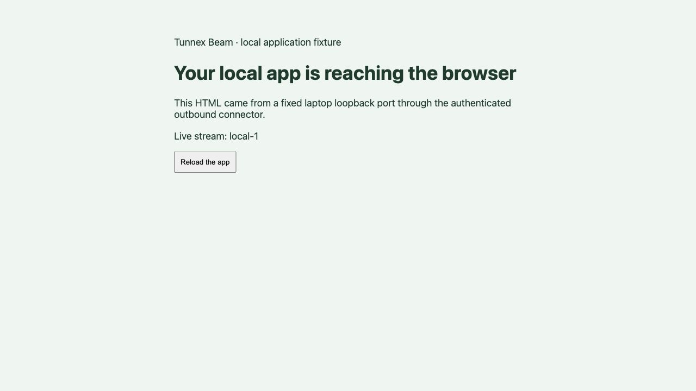

# Beam local development evidence

Prepared: 2026-10-06. Stage: **Historical BM-0 foundation evidence. Product implementation and qualification have progressed beyond this original checkpoint; see the epic's current evidence table and BM-5 compatibility guide. Full story acceptance is tracked separately.**

| Checkout | Branch and baseline | Local changes |
| --- | --- | --- |
| Core `/private/tmp/tunnex-beam-plan` | `extra-feature`, `7ed12a91` | Separate Beam broker/gateway seam; isolated native transport fixture; epic, authority contract and evidence |
| Client `/private/tmp/tunnex-client-beam` | `extra-feature`, `9b71d19` | Native main-process connector module; input and core-dependent integration tests; local demo programs and scripts |
| Original core `/Users/pawangupta/tunnex` | `fix/web-publish-native-build`, `f66abaad` | Unchanged and clean |
| Original client `/Users/pawangupta/tunnex-desktop` | `main`, `9b71d19` equal to pulled `origin/main` | Unchanged and clean after the requested fast-forward pull |

No feature commit, push, PR or deployment was made. Changes remain local and uncommitted in the isolated worktrees. Tests use synthetic identities and task-owned loopback fixtures, not customer databases, accounts, deployed gateways or the real VPN helper.

## Implemented foundation

| Component | Result |
| --- | --- |
| Authority contract | Human publisher/reviewer boundaries, delegated audience, immutable target/serving binding, lifecycle, domain constraints and remaining production admission responsibilities recorded |
| Shared transport | New `beam_proxy` audience, `/beam/channel` and independent broker pool; existing App Access browser/check audiences and origin refusal retained |
| Gateway seam | TLS 1.3 and verified mTLS certificate required before the supplied current-authority callback; exact server-owned assignment headers required |
| Native client module | No inbound listener; immutable numeric loopback target; native TLS/HTTP; no VPN helper or renderer credential exposure |
| App boundary | Relative request targets, credential stripping, application cookie preservation, safe redirects, broader-cookie rejection and bounded HTTP bodies |
| Local demo | Genuine TLS connector, actual local HTTP app and visible live SSE updates; synthetic fixture reviewer and authority, clearly labelled as local development |

## Verification

| Check | Result and scope |
| --- | --- |
| Client toolchain | Repository-required Node `24.21.0`, pnpm `10.34.5`; locked dependencies installed in the isolated worktree |
| Client typecheck | Passed, including native source, unit tests and development fixtures |
| Client main build | Passed; native connector is emitted in main output, development/test fixtures excluded |
| Full client regression | **326 passed, 0 failed, 0 skipped**; includes existing tunnel/auth/relay/lifecycle tests and new Beam input-boundary tests |
| Native cross-repository integration | **2 passed, 0 failed, 0 skipped**; real TLS proxy, outbound native connector and loopback app |
| Integration admission | Foreign organization and CA-valid unknown connector certificate rejected; an unauthenticated fixture reviewer receives no app |
| Integration immutable target | Mutating the caller's target/hostname during TLS admission does not change the captured local app or binding |
| Integration HTTP | HTML, body POST, application cookie, trusted forwarding host; reserved Tunnex/Beam identity material absent at origin |
| Integration response boundary | External/metadata redirect and wider cookie domain rejected; safe local redirect maps to the published hostname |
| Integration long streams | Real SSE data and masked WebSocket echo pass; revoke and authority outage close both within five seconds; new admission denied afterward |
| Shared Go transport | `go test -race ./...` passed across the transport module and new Beam package, including existing policy/lease/restore/recording protocols |
| Existing App Access proxy | Full `go test -race ./...` passed in `apps/app-proxy` |
| Existing gateway runtime | `go test -race ./internal/appaccess` passed in `apps/node` |
| Rendered browser | Dashboard shows actual broker readiness; reviewer app renders origin HTML and advancing SSE messages in Codex in-app Browser |

The initial standard client test attempt hit sandbox Unix-socket restrictions. A run with local listener permission resolved those environment failures. The suite then caught a core-dependent test placed outside its standard script inventory; moving it to the explicit dev integration command retained the ordinary inventory guard. Final results above are from the corrected layout with local listener permission.

## Remaining feasibility and product work

At this original checkpoint Electron wiring, Vite HMR and packaging were pending. Subsequently actual Electron main/preload/renderer smoke and real production CP PKCE login passed, genuine Vite file edits produced HMR, and macOS ARM64/Windows x64 package contents were verified. Native Windows execution and final real publisher/reviewer walkthrough remain unqualified. Do not treat the historical test counts above as the latest inventory.

Persistent publisher/grant/policy/session APIs and current-source revocation checks are now implemented and exercised against disposable PostgreSQL, a real dedicated proxy and native connector. Operator installation readiness and the complete acceptance matrix are still being qualified. The original local HTTP viewer and synthetic sign-in do not prove production browser authentication, cookie/site isolation or public certificate setup.

## Reproduction

Build `packages/apptransport/cmd/beam-spike` to `/private/tmp/tunnex-beam-spike`, then use `BEAM_SPIKE_BIN` with the client's `test:beam:integration` or `dev:beam` commands. Full instructions are in the client worktree's `docs/BEAM-local-development.md`. Run the standard core and client gates from their own worktrees.
