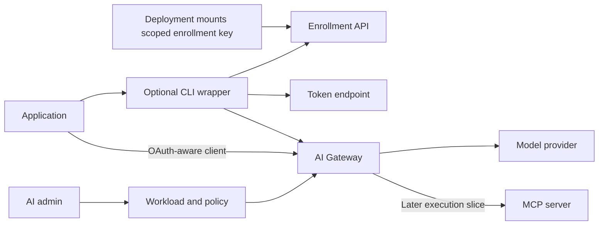

# Workload identity: one command, policies at AI Gateway

Research and implementation proposal, 2026-09-09.

**Status: approved for implementation, 2026-09-09.** The user said
“do whatever recommended” after receiving the competitor research and plan.
The recommended core decisions below are locked for implementation. Optional
federation, deployer automation and scheduled key rotation remain named follow-ons.
Commands and behavior become available only after their implementation and proof.

Source baseline: `ai-improvement` at `db683fa5`. Implementation runs in isolated
`story/S-AI-workload-identity` to preserve the original checkout's uncommitted MCP
and UI work. Existing MCP discovery corrections will be integrated only with the
central MCP slice; the original files remain untouched. No deletion of legacy
identities, remote publication, merge or production deployment is authorized here.

## 1. Recommendation and operator experience

Make **Workload** the permanent non-human identity inside AI Gateway. A workload
is an application, service or bot, such as `production/support-bot`. Attach model
permissions to that identity. Machines and process replicas are instances of it;
they do not require individual policy setup.

Use a **NetBird/Tailscale-style enrollment key** to register a fresh instance
public key, then independent authentication to obtain short-lived gateway tokens.
Offer single-use keys for individual installs and scoped reusable keys for
autoscaling. Reusable enrollment works without a separate broker, OIDC provider
or cloud-specific integration. The key fixes the parent workload on the server;
replicas inherit its policy automatically.
Provide this through the existing `tunnex` CLI. No WireGuard peer, VPN gateway
selection, root access, human login or separate AI Agents wizard is required for
model access. Do not require a new external identity platform for the basic path.

Runtime command implemented in the local story preview, **not yet released or production-qualified**:

```sh
tunnex workload run --config /run/secrets/tunnex/workload.json -- python agent.py
```

The administrator creates the workload, selects its allowed models, and obtains
its connection instructions. The configuration is provisioned as a protected
file, by the administrator for a single machine or by deployment automation for
replicas. The command enrolls if necessary, maintains authentication, and runs
the application. This is one runtime command after administrative setup, not a
claim that a workload can establish trust without any preconfigured authority.

The file identifies the Tunnex HTTPS server and a protected enrollment-key file.
For autoscaling, deployment automation mounts the current reusable key at the
same path on each replica. Instance private state is generated separately on
each replica. The workload is already encoded by the server's key binding; the
application does not supply another group or policy selector. Never put the raw
key in command arguments, a URL, a container image or logs.

Proposed generated configuration (schema to be defined with the CLI contract):

```json
{
  "server": "https://tunnex.example.com",
  "enrollment_key_file": "/run/secrets/tunnex/enrollment-key",
  "state_directory": "/var/lib/tunnex-workload"
}
```

The state directory must be private and unique to a replica, writable by its
unprivileged process/container user. Ephemeral deployments may use an empty
per-replica volume; a shared deployment volume must never share instance keys.
Credentials/config are provisioned once through the deployment mechanism; only
the `run` command appears in its process entrypoint.

For applications using supported SDK environment variables, `run` supplies a
loopback API base and a random local session credential. Its small process wrapper
refreshes the actual gateway token. It does not evaluate model or tool policy.
Applications that already implement OAuth can call the gateway directly without
the wrapper. Clients with hardcoded endpoints need their base URL configured;
the CLI cannot transparently redirect arbitrary application traffic.

## 2. What the research supports

The recommendation combines an ordinary service-account product model with a
replaceable instance identity. Actual NetBird, Tailscale and Headscale source was
read at pinned commits. See the [competitor source review](S-AI-workload-enrollment-research.md)
for functions, immutable links and the distinction between Tailscale public
client code and its hosted server documentation.

| Approach | Relevant behavior | Recommendation for Tunnex |
| --- | --- | --- |
| NetBird setup keys | Single-use/reusable keys enroll peers into server-selected groups; registration and key-use accounting share a transaction. | Adopt workload-scoped reusable enrollment for autoscaling and single-use keys for individual installs. |
| Tailscale auth keys and tags | Auth keys introduce independently keyed nodes; keys carry tags and ephemeral settings. OAuth can automate generation of fresh auth keys. | Adopt automatic policy association and separate join/runtime credentials. OAuth automation remains optional. |
| Headscale pre-auth keys | Server code separates tagged ownership from human creators and atomically consumes single-use keys. | Reuse the state-model lessons for independent workloads, idempotent enrollment and concurrent replacements. |
| LiteLLM service-account keys | Production identity is independent of an individual user's lifecycle and can have team limits. | Reuse the familiar service-account concept, but avoid a shared long-lived gateway bearer as the default runtime identity. [Service accounts](https://docs.litellm.ai/docs/proxy/service_accounts) |
| Shared permanent gateway API key | Simple model calls, but replicas share runtime authority and individual revocation is coarse. | Avoid as the default runtime identity. A bounded reusable enrollment key has separate introduction semantics. |
| OAuth client credentials with a registered public key | RFC 9700 recommends asymmetric client authentication; the server need not retain a reusable client secret. | Preferred authentication for instances introduced by an enrollment key. [RFC 9700 §2.5](https://www.rfc-editor.org/rfc/rfc9700.html#section-2.5), [RFC 7523](https://www.rfc-editor.org/rfc/rfc7523.html) |
| Teleport bot and bot-instance separation | A stable bot can have multiple independent runtime instances; joining and renewal have distinct lifecycles. | Reuse that identity separation, not Teleport's entire host-access stack. [Architecture](https://goteleport.com/docs/reference/architecture/machine-id-architecture/) |
| Vault AppRole introduction | A trusted deployment system delivers bounded bootstrap material to an application. | Apply the trusted-delivery pattern for generic VM/on-prem automation; Vault itself is optional. [AppRole guidance](https://developer.hashicorp.com/vault/docs/auth/approle/approle-pattern) |
| Trusted JWT/OIDC workload identity | An existing issuer can supply verifiable identity, which a token exchange maps to gateway access. | Optional advanced authentication where an issuer already exists; not required for the basic autoscaling recipe. [RFC 8693](https://www.rfc-editor.org/rfc/rfc8693.html) |
| SPIFFE/SPIRE | Standard workload identities across environments, including rotation through a Workload API. | Integrate existing deployments later; installing SPIRE is not a prerequisite for the simple path. [SPIFFE overview](https://spiffe.io/docs/latest/spiffe-about/overview/) |

Inference from these sources: the smallest useful Tunnex product is a stable
workload, its gateway policy, a scoped enrollment key and renewable instance
authentication. Initial enrollment is preauthorized by the AI admin creating the
key. A second approval for every new replica would defeat unattended scaling.
A complete machine access platform, custom certificate authority or cloud SDK
is unnecessary for that core. This is a behavioral adaptation, not a literal
copy of a competitor's networking backend.

## 3. Verified current code: reuse and gaps

| Current source | Observed contract | Planned treatment |
| --- | --- | --- |
| [Device bootstrap](../apps/api/internal/devices/service.go), `IssueAgentBootstrapToken` | Enrollment is bound to an active gateway node. | Reuse atomic hashed-grant patterns, not the device/gateway relationship. |
| [Managed runtime](../apps/cli/internal/cli/managed_runtime.go), `BootstrapManagedAgent` | Generates an X25519 key and creates managed host state. | Keep for existing host networking. Workload login uses a separate signing key and storage namespace. |
| [AI credentials](../apps/api/internal/aigateway/credentials.go), `Issue`, `lockAIIdentity` | Five-minute opaque tokens depend on current runtime credentials, active agent devices and human ownership/membership. | Add independent workload authentication; preserve the legacy route. |
| [AI policy](../apps/api/internal/aigateway/policy.go), `authorizedPolicy`, `Resolve` | Team policy and model bindings depend on agent groups and device assignments. | Reuse model/provider validation and revision-based reconciliation through a new workload subject. |
| [Human model access](../apps/api/internal/aigateway/user_access.go) | Human group grants are separate; management role does not itself authorize inference. | Keep working; share model-selector and grant-validation behavior. |
| [Inference adapter](../apps/api/internal/aigateway/adapter.go), `Grant` | `Agent` carries the subject ID; `SubjectKind` distinguishes humans from legacy agents. | Introduce an explicit typed subject and instance ID through an additive compatibility adapter. |
| [Usage](../apps/api/internal/aigateway/usage.go) | Native engine accounting is authoritative; retained bindings preserve historical attribution; reads are bounded at 64 bindings. | Add stable workload attribution without allocating a native key for every replica. Audit capacity and pagination before production claims. |
| [Cost admission](../apps/api/internal/aigateway/usage.go), `enforceCostMode` | The daily soft threshold refuses new calls after observed spend reaches it; concurrent calls may overshoot. Missing required price/cost data also refuses admission. | Preserve these semantics and explain them; do not relabel it as alert-only or a guaranteed hard budget. |
| [Video jobs](../apps/api/internal/aigateway/video_jobs.go), [owner migration](../apps/api/db/migrations/0150_ai_user_model_grants.up.sql) | Ownership and idempotency currently support a device or a user. | Add workload ownership explicitly; replacement instances can retrieve their workload's jobs without crossing workload boundaries. |
| [CLI AI commands](../apps/cli/internal/cli/ai.go) | `tunnex ai models/chat` use a saved human login. | Add workload commands without overwriting or borrowing that login. |
| [MCP proxy](../apps/cli/internal/cli/mcp_proxy.go) | Actual tool enforcement lives in a local runtime proxy. | A central MCP execution route is required before claiming gateway-level tool enforcement. |
| [MCP connections](../apps/api/internal/mcpconnections/service.go), local uncommitted work | Shared credentials and catalog discovery are being added; private discovery still depends on a selected managed runtime. | Reuse reviewed transport/sealing components; do not equate a catalog with a central execution gateway. |
| [Gateway page](../apps/web/src/pages/AgentsAIGateway.tsx), [sidebar](../apps/web/src/components/AppShell.tsx) | Models, human access, usage and settings coexist with a separate AI Agents area. | Put workload creation, access and connection instructions in AI Gateway; retain legacy host features during migration. |

The API already depends on `go-oidc`, OAuth support and `go-jose`; the CLI has
[atomic private-file writes](../apps/cli/internal/cli/state.go). Reuse maintained
libraries and these patterns after checking their contracts. Existing workflow
provenance signing is a different protocol: neither its keys nor the WireGuard
key become OAuth credentials.

## 4. Identity, policy and gateway boundary



The permanent policy target is the workload UUID, not its name, IP, hostname,
instance ID, human creator or claimed request metadata. Example:

```text
Workload: production/support-bot
Models: the two exact configured model IDs chosen by the AI admin
Daily soft threshold: optional, aggregated across its instances
Instances: replica A, replica B, replacement C
```

Start with one directly attached model policy per workload. Do not require a
second team/group object before it can connect. A reusable policy-template or
workload-group feature can follow if there is demonstrated demand. An optional
owning people group is accountability metadata; it grants neither model access
nor organization administration and cannot silently delete the workload.

At each inference request, the gateway checks organization availability/opt-in,
token validity, workload and instance state, current policy, configured model
and mode, provider state, and applicable admission limits. Policies are not baked
into a long-lived token. Revocation denies new admissions after its commit;
already admitted requests retain the existing bounded completion behavior.

The caller receives neither provider credentials nor private engine keys.
Reconciliation and native accounting stay behind the gateway. A token cannot
become an administrative login by changing the URL, scope or organization header.

This controls requests that pass through Tunnex. It does not intercept a program
using unrelated credentials to call a public provider directly, and does not
replace host network controls. Private upstream routes belong to gateway
infrastructure; a connector is only necessary where that infrastructure lacks
the required network path.

## 5. Enrollment and automatic authentication

### 5.1 Basic path: scoped key, independent instance

1. AI admin creates a workload and its model policy, then requests connection
   instructions. Creating a workload alone grants no model or admin authority.
2. The server creates an opaque, hashed, workload-bound enrollment key. The
   Connect panel offers **Single instance** (single-use) and **Autoscaling
   deployment** (reusable). The key is shown once and delivered through a
   protected file. Only paths appear in the command.
3. The CLI generates a fresh signing key locally and proves possession during
   enrollment. It submits the enrollment key, public key and durable request
   identifier, bound together by the proof.
4. One database transaction locks and validates the enrollment key, checks
   expiry/revocation/use limits and workload state, then creates the instance and
   records one successful use. Single-use allows one instance; reusable allows
   independent instances within its limits. A request cannot choose another
   organization, workload, tag, role or policy.
5. The response contains public instance/client identifiers and endpoint metadata.
   The CLI obtains an access token separately using the registered key. A lost
   enrollment response must be recoverable: retrying the same key, request and
   public-key proof returns the same public receipt. Reusing that request ID with
   another public key is denied. A distinct request/public key is a new enrollment,
   allowed only if the enrollment key is reusable and remains valid within limits.
   Receipt retries do not increment uses. A receipt contains no bearer token and
   cannot reactivate a revoked instance. Key/workload revocation denies new
   enrollment regardless of an old request identifier.
6. Subsequent process restarts reuse protected per-instance state without needing
   a still-valid enrollment key. A fresh machine creates a fresh instance keypair
   using the deployment's current reusable enrollment key (or a fresh single-use
   key). Copying a state directory into a machine image is not supported.

Recommended initial defaults, all Tunnex proposals rather than competitor facts:

| Setting | Proposed behavior |
| --- | --- |
| Single-use key | 24-hour validity; one successful instance enrollment. |
| Reusable key | 30-day validity; maximum 90 days per issued key. Renewal creates a new key with an overlap window; never silently extend an old secret. |
| Reusable use limit | Optional total successful enrollments, clearly distinguished from simultaneously running replicas. Leave unlimited within the key lifetime when replacement count is unbounded. |
| Admission protection | Shared per-key/workload request limits and explicit org capacity; no hidden per-human device quota. Size headroom for rolling replacements. |
| Parent binding | Immutable workload and organization; permissions are the workload's current policy. Display names never establish authority. |
| Ephemeral instances | Default for Autoscaling deployment; durable state is optional for short-lived replicas. Cleanup details below. |

Keep multiple active enrollment keys per workload for non-disruptive rotation.
Expose uses, last enrollment, expiry and rotation status, with advance expiry
notifications. A reusable key holder can enroll another instance of that workload;
scoping is not proof that the caller runs on an approved physical machine.

Key possession proves continuity of an enrolled identity, not host integrity.
A compromised process that can read its instance key can act as that instance
until revoked. The design must not claim hardware attestation for this path.

### 5.2 Token protocol and rotation

Use OAuth `client_credentials` with `private_key_jwt` for enrolled instances.
The client ID identifies the instance; the server resolves its parent workload.
Use a standard JOSE library, a fixed supported signing algorithm, registered
public keys, strict issuer/subject/audience/time checks and a short assertion
lifetime. Require replay protection in Tunnex even though RFC 7523 permits
deployments to choose it. [RFC 7523](https://www.rfc-editor.org/rfc/rfc7523.html)

Recommended Tunnex defaults: assertions live at most 60 seconds with at most
30 seconds of clock skew; access tokens live at most 5 minutes. Store only hashes
of opaque access tokens, with workload, instance, audience, credential generation
and expiry. The first supported scope is model access. Enrollment keys cannot
be used as access tokens. Never fetch keys from caller-supplied JWT URLs.

Acquire replacement access tokens before expiry with jitter and one renewal in
flight per instance. Reauthenticate instead of adding a second long-lived refresh
secret; the client-credentials flow does not normally issue refresh tokens.
[RFC 6749 §4.4.3](https://www.rfc-editor.org/rfc/rfc6749.html#section-4.4.3)

Instance key registration is durable until explicit revocation, retirement or
administrator-set instance expiry, separately from enrollment/access-token expiry.
Provide key rotation using a candidate key, proof with old and new keys, atomic
generation change and crash-safe recovery. Establish that recovery protocol before
enabling scheduled rotation; a 24-hour schedule is a later hardening option,
not a prerequisite for initial autoscaling.
Previously issued access tokens can remain valid for their existing short expiry
unless an administrator revokes the instance. Superseded keys cannot issue new
tokens after promotion. A rotation failure must not destroy the last valid key.

Replay state, revocation and generation checks must work across API replicas.
Do not rely on process-local replay maps. Choose a durable uniqueness constraint
or an existing shared store with defined failover guarantees; do not claim strict
replay refusal after an acknowledged write can be lost. Unavailable authority
returns an explicit service error rather than authorizing from stale state.

### 5.3 Autoscaling: one policy, replaceable replicas

1. Create `production/support-bot`, assign exact configured models and optional
   workload-wide threshold, and choose Autoscaling deployment in Connect.
2. Put its reusable enrollment key into the deployment's existing secret store or
   protected configuration delivery. No new broker product is needed.
3. Every replica runs the same command. A new instance creates a fresh signing
   key, enrolls under the same workload and obtains its own short-lived token.
4. The replacement immediately receives the same current workload policy once
   authorized; no per-machine admin assignment or human login is needed.
5. Rotate the bootstrap before expiry: create replacement key, update the mounted
   secret, prove a fresh canary enrolls, then revoke the previous key. Running
   instances keep their separate credentials. The CLI rereads secret files for
   new enrollment attempts rather than caching an obsolete file forever.

This is cloud-independent: VM, container, bare metal and on-prem automation all
use HTTPS plus a protected secret file. Where secrets are unavailable to new
machines, the infrastructure must supply them or use the optional trusted-issuer
path. No authentication system can admit an unknown replacement with no proof.

An expired/revoked/exhausted setup key blocks **new** instances, not already
enrolled ones. Alert before expiry or low remaining uses; test scale-out as part
of rotation. Never reuse a consumed single-use key as the autoscaling recipe.

### 5.4 Optional automation without a shared deployment key

- **Trusted JWT/OIDC integration:** configure an allowed issuer, verification
  keys, audience and exact identity claims on the server. The runtime rereads a
  rotating identity-token file and exchanges fresh proof. Use RFC 8693 for the
  exchange, with no authority taken from arbitrary workload names or JWT URLs.
  Trust is mapped to an existing workload, never to new organization roles.
  [Token exchange](https://www.rfc-editor.org/rfc/rfc8693.html)

- **Restricted deployer integration:** existing automation may mint short-lived
  single-use keys only for explicitly authorized workloads and deliver them to
  replacements. Its credential grants enrollment issuance, never policy edits,
  provider-secret retrieval or inference. The human `ai-admin` credential does
  not go into the launch template. This supports installations that prefer an
  individual introduction per replica; it is not necessary for reusable keys.

JWT federation is recommended where an issuer exists. For Kubernetes, projected
service-account tokens support intended audiences and rotation; bind trust to
the configured cluster issuer and service account/namespace, and explicitly
choose offline validation versus TokenReview-based early revocation behavior.
Do not claim immediate pod-deletion revocation from signature validation alone.
[Kubernetes service-account tokens](https://kubernetes.io/docs/tasks/configure-pod-container/configure-service-account/)

Federated instances must present fresh external proof for continued issuance;
enrollment must not silently upgrade a temporary issuer token into an indefinitely
renewable Tunnex private-key credential. Define issuer-specific replay semantics:
rotating projected tokens can be reused during their validity, unlike a single-use
join grant or one-use client assertion. Record the independently verified source
identity and expiry. Any session/instance handle is attribution, not substitute
authority once that proof expires.

### 5.5 Instance lifecycle and availability

Scale-out creates new instance rows, not new workloads or policy records. Start
accepting work only after authentication, model-list authorization and required
connectivity succeed. Do not automatically send paid inference probes at every
startup. During a rolling replacement, keep old healthy capacity until the new
instance is ready. Ordinary process exit preserves its instance for restart.
Drain and explicitly retire the instance on permanent replica removal. Automatic token
renewal updates last authenticated contact even when the application is idle;
absence of model calls alone must not trigger cleanup.

For ephemeral instances, initially show offline after ten minutes without
authenticated contact and retire after 24 hours. These proposed intervals should
be configurable at deployment setup. Retirement revokes remaining authority but
retains usage/audit attribution. Use a database condition on current state,
last-contact deadline and generation to prevent cleanup racing with renewal.
Sweep in bounded batches; do not rely on an API replica's in-memory timers.
Pause cleanup during an authority outage and allow a recovery interval before
sweeping, so a control-plane restart does not mass-retire healthy clients.

Persisted instances that were retired by inactivity may explicitly obtain a new
identity with fresh valid enrollment proof. An admin-revoked instance returns a
terminal error; the CLI must not silently retry it as a different identity.
Durable instances remain offline until revoked/expired and are not automatically
retired for inactivity. The UI distinguishes offline reporting from access state.

| Administrative action | Effect |
| --- | --- |
| Stop new enrollments / revoke enrollment key | Refuse new joins with that key. Existing instance keys/tokens remain independently governed. |
| Revoke instance | Deny that instance's next token issuance and request admission. Other replicas continue. |
| Revoke key and its enrolled instances | Atomic key revocation plus a durable revocation generation/cutoff checked on all descendant instances; cleanup can follow asynchronously. |
| Disable workload | Deny enrollment, issuance and request admission for all its instances; retain policies and history. |

Disabling increments the workload's credential generation. Re-enabling does not
resurrect old bearer tokens or revoked credentials; the Connect panel explains
the required new issuance or enrollment. Temporary network failure never mutates
this administrative state.

Revoking just an instance cannot stop someone still holding a valid reusable key
from enrolling a different instance. The combined revoke action or workload
disable is required to contain that compromise. This boundary is shown in the
Connect/Instances UI and audited with the actual affected scope.

Renewal retries can use an unexpired token while the gateway still validates it.
Expiration is never extended locally. A gateway/database outage can still block
requests; central enforcement requires a reachable authorization service.
Gateway redundancy, shared state and tested restart/failover behavior are part of
production qualification, not a promise of zero outages.

## 6. CLI and UI design

Keep the main journey to three actions: **Create workload → Choose models →
Connect application**. Offer the existing configured-model picker and a plain
optional soft-threshold field. Show the endpoint and permitted model IDs in the
connection panel. Enrollment uses the administrator's selected workload, so the
runtime does not ask users to choose another group or policy.

Recommended navigation:

- AI Gateway: Models & endpoints, Credentials, Access, Usage & cost, Settings.
- Access: People & groups and Workloads as clear subsections. Workload detail:
  Overview, Access, Connect, Instances, Activity.
- MCP: server connections and discovered tools remain a separate resource
  workspace, linked from a workload's tool permissions when central execution is
  implemented.
- Existing AI Agents host pages: retained as Managed runtimes during transition,
  reachable from workload/advanced settings. Do not make them a required entry
  point for new model consumers or remove existing network controls.

The `run` wrapper binds only loopback on an allocated port, requires a fresh local
session credential, forwards only known AI API paths to its configured HTTPS
gateway and streams responses. It strips caller-supplied upstream credentials
and routing headers. It is not a general HTTP proxy. A local credential does not
authenticate to the remote gateway. Processes sharing a host account are not a
new security isolation boundary; multi-tenant deployments need existing OS or
container isolation.

Keep gateway token renewal inside the wrapper instead of injecting one expiring
token into an application environment once. Environment variables in an already
running child cannot be changed by its parent to rotate that token. In the
initial UX support tested OpenAI-compatible SDK configuration; document the
Anthropic-native base/auth requirements separately rather than assuming every
SDK interprets the same variables and path prefixes.

Add `workload enroll` for enrollment only and `workload token` for OAuth-aware
integrations as advanced commands. Token output must be explicitly requested or
written to a protected file. No human `tunnex login` state is modified. Use the
existing verified CLI distribution; do not add an unrelated curl-to-shell
installer. Deployment images contain the binary and non-secret settings only.

States must be actionable: awaiting enrollment, connected, reconnecting,
authentication failed, policy denied, disabled, endpoint unreachable and expired.
Explain whether an error came from enrollment, gateway policy or the upstream
provider. Preserve actual upstream HTTP codes when received; DNS/connect failures
have no provider HTTP code. A successful readiness check is not a model-inference
test. Use the existing theme, form components and Sonner conventions.

## 7. Implementation contracts and minimal data model

These are proposed names, not generated contracts. Confirm them in OpenAPI before
implementation and generate Go/TS/RBAC from the source of truth.

| Record | Responsibility |
| --- | --- |
| `workloads` | Stable org-scoped ID, display name, enabled/archived state, revision and accountable owner metadata. No device FK or synthetic human account. |
| `workload_instances` and registered keys | Parent workload, originating enrollment-key ID, client ID, lifecycle state/reason, credential generation, public keys, last authenticated contact, ephemeral setting and optional expiry. |
| `workload_enrollment_keys` and enrollment receipts | Hashed secret, immutable parent, single-use/reusable setting, expiry, total-use limit/count, revocation/descendant cutoff and per-request public-key-bound receipt. |
| `workload_access_tokens` | Hashed opaque token, org/workload/instance, audience/scope, expiry and revocation. |
| Workload model-policy/binding records | Exact connection/model/mode grants, desired/applied revisions and retained native accounting identity. |
| Automation trust records | Optional issuer claim mappings or deployer-to-workload enrollment authority. Basic reusable-key autoscaling does not depend on them. |

Use composite tenant-scoped foreign keys, optimistic revisions and deterministic
lock ordering. Revocation persists before private-engine cleanup, so cleanup
failure cannot preserve access. Archive/revoke first; retain attribution according
to existing audit/usage retention instead of cascading away production history.
Owner departure does not revoke or delete a production workload by accident.

Proposed management APIs, all organization scoped:

- Workload create/list/get/update/archive; list/revoke instances.
- Read/update a workload's model policy and expose desired/applied/error state.
- Create/list/revoke enrollment keys, with an explicit combined instance-revoke
  action; rotate an instance key and inspect non-secret metadata.
- Configure/revoke issuer trust or restricted deployer authority in the optional
  automation slice.

Proposed machine APIs:

- `POST /api/v1/workload/enroll`: enrollment key plus public-key proof → public receipt.
- `POST /api/v1/workload/token`: OAuth client authentication or validated token
  exchange → scoped gateway bearer. Publish accurate discovery metadata.
- Instance-key rotation and graceful retirement routes: require current
  instance authentication with a narrow self-management audience. An inference
  bearer alone cannot register another signing key or manage sibling instances.
- `GET /ai/v1/models`: return only currently allowed configured models.
- Existing `/ai/v1/...` inference routes: accept the new subject type alongside
  existing clients; do not duplicate model-provider implementations.

Keep JSON management/enrollment errors and OAuth token-endpoint errors consistent
with their respective protocols. Describe schemas, request bounds, replay rules,
error responses and secret redaction in OpenAPI; machine routes use explicit
machine authentication, never browser-session fallback.

Add named workload management/view/enrollment permissions. `ai-admin` can manage
workloads and their AI access; `ai-view` can inspect non-secret state. Neither
role gains VPN administration. Workload credentials are inference principals,
not human organization roles. Deployer enrollment authority is separately scoped
and never inherited merely because a workload can invoke a model.

Normalize authenticated subjects as `{org, kind, id, instance_id}`. Use the stable
workload ID for policy, native billing identity and per-workload admission; use
instance ID for diagnostic attribution and individual revocation. Include subject
kind in cache, video ownership, idempotency and rate/admission keys. Reuse one
native accounting binding per workload/policy lineage, not per machine rotation.
Policy moves preserve previous accounting attribution. Optional per-instance cost
breakdowns require trustworthy request attribution; do not invent them from a
shared native key's aggregate total.

## 8. Gateway-level MCP execution

Keep the initial model-login slice small, but do not declare the complete
gateway-control objective finished until tool execution is addressed.

Add a gateway endpoint identified by a saved MCP server ID, not a caller-provided
URL. It authenticates the same workload through a separately scoped/audience-bound
MCP token, checks its server/tool grant, and uses that server's configured upstream
credential. Workload tokens are never passed to upstream MCP servers. The MCP
authorization specification requires resource-bound token handling; the public
MCP route needs its documented metadata/authentication contract, not an assumption
that every MCP client accepts the AI bearer. [MCP HTTP authorization](https://modelcontextprotocol.io/specification/2025-11-25/basic/authorization)

Reuse the collector and normalization code in `packages/mcp`, the existing tool
predicate/argument checks and reviewed credential sealing. Move enforcement into
a server-side service with shared state for applicable rate limits and one-use
approvals; do not transplant process-local counters and call them cluster-wide.

`tools/list` shows only permitted, current tools, and `tools/call` repeats the
authorization check. New tools and changed schemas stay denied until reviewed.
Complete authenticated discovery must precede grants; partial/failing inventory
is not a successful empty list. Bind sessions, cursors, schema revisions and
credential caches to organization, workload, server and current connection
revision. Handle streaming/session reconnects without sharing upstream sessions
between unrelated identities.

Private MCP servers require a network path from the gateway/connector. Until that
path and the central execution route are proven, retain the local runtime path
and label it accurately. Existing per-agent OAuth consent is not automatically
converted into a shared service credential or a workload grant.

## 9. Reviewable implementation sequence

| Slice | Deliverable | Acceptance before proceeding |
| --- | --- | --- |
| 0. Decide | Disposition the recommendations here; inventory legacy users, policies and retained keys read-only; record exact compatibility boundaries. | Approved decision record, no silent destruction or approval of held MCP findings. |
| 1. Identity and policy | Add org-scoped workloads, instances, single-use/reusable enrollment keys, public-key registration and workload policy contracts. Generate schema clients/RBAC. Add typed subject support behind the new path. | Isolated DB tests in both editions: tenant binding, ownership independence, atomic use limits/idempotency, revision, single/combined revoke and archive behavior. |
| 2. Usable one-command model access | OAuth issuance, CLI enroll/run/token, native gateway authorization, model listing, usage and video ownership. Implement Create/Access/Connect, automatic access-token renewal and recoverable instance-key rotation. | Fresh process enrolls and calls allowed models; denied models fail at the real gateway even without the wrapper. Existing human and legacy agent flows still pass. |
| 3. Production deployment lifecycle | Reusable-key secret reload/rotation, expiry notification, readiness, graceful exit, idle renewal, ephemeral retirement and recovery. | Twenty replicas and destructive replacement in an isolated fixture; no copied state or manual reassignment. Two API replicas exercise use limits, key expiry, combined revocation and cleanup/renewal races. |
| 4. Central MCP execution | Workload server/tool grants, authenticated discovery and public MCP transport with resource-specific auth. Reuse reviewed connection work. | Local authenticated MCP server: allowed tool succeeds, unselected/new/changed/revoked tool fails at the gateway; same results from direct requests and the CLI. |
| 5. Migration and navigation | Offer explicit legacy-to-workload mapping previews; move new onboarding into AI Gateway; retain host/network features and old routes. Update core and website docs. | Before/after access parity, no new privilege, no lost historical usage, backward-compatible routes and visual walkthrough. |
| 6. Production qualification | Full applicable generated-code, API/CLI/web gates; multiple API replicas; restart, expiry, issuer outage and gateway failover walks. | Evidence tied to the exact implementation revision; limitations and missing platform proofs named, never treated as green. |
| Optional federation/automation | Trusted-JWT source, issuer mappings and restricted deployer API; existing SPIFFE integration if needed. | Claim/audience validation, key rotation, trust revocation, proof expiry and limited deployer authority. Never advertise this path before those tests pass. |

Slice 2 establishes model access; slice 3 must pass before claiming unattended
autoscaling. Slice 4 covers the existing central tool-control request. Federation,
SPIFFE and provider-specific attestation are optional integrations, not blockers
for the basic cloud-independent deployment path. Do not introduce pricing/edition
changes in this story;
preserve current organization AI opt-in and review feature gates explicitly.

## 10. Migration, rollback and verification

Use additive migrations; select the migration number when implementation starts,
after checking the then-current main and the pending MCP migration. Do not edit
existing migration contents or repurpose the current `devices`/runtime tables.
Legacy device credentials remain valid under their existing path; new workload
tokens never authenticate to legacy machine or admin endpoints.

Provide an administrator-reviewed mapping: legacy agent → workload, existing
effective models → workload model grants, historical accounting → retained source
attribution. Do not auto-union several agents' differing permissions into a broader
shared workload. Do not convert people groups into workload groups. Keep old
network resources and per-agent tool grants until their explicit migration.

Rollback disables the new path and navigation while retaining new rows and audit
history; it does not restore revoked tokens or restore access from stale policy.
After workloads depend on the new path, operational rollback needs a maintenance
plan. Down-migrations must refuse destructive loss of active identity or usage
data. Existing gateway/provider configuration is preserved.

Required proof cases:

1. Simultaneous single-use redemption produces one instance. Same-key/request
   retry after a dropped response recovers it without another use. Reusable keys
   create distinct instances up to their atomic total-use limit; one reused
   request ID cannot bind another public key. Expired/revoked keys, cross-org
   substitutions and signing-algorithm/key-source confusion are refused.
2. Run a test long enough to cross several access-token renewals; separately use
   a controllable clock for key rotation, crash recovery, clock skew and expiry.
   Repeat with zero model traffic: background renewal preserves a healthy idle
   instance. A stale cleanup worker cannot retire a freshly renewed instance.
   Unavailable replay/authorization state cannot result in successful admission.
3. Spawn 20 independent replicas under one workload, replace half, kill one
   abruptly, and restart a surviving process. No copied private key, manual
   re-enrollment or multiplying native accounting keys. Expire/revoke the setup
   key: existing instances still work and new joins fail. Rotate the mounted key
   and prove a new replacement works with the same workload policy.
4. Revoke one instance while others continue; disable the workload and show all
   subsequent calls denied across API replicas. Test combined key/descendant
   revocation, and prove a disabled/re-enabled workload cannot revive old tokens.
   Test policy tightening concurrent with issuance and request admission.
   Preserve existing accepted-stream bounds.
5. Denied model/mode, cross-workload video read/idempotency, altered identity
   headers and direct `/ai` calls cannot bypass the gateway. Run representative
   JSON, streaming, multipart, binary and asynchronous model modes already offered.
6. Verify observed-cost refusal, UTC boundary and aggregate spend across replicas;
   concurrent overshoot remains documented. Retained-binding capacity, missing
   pricing and uncosted usage do not become zero or free access.
7. When optional federation ships, validate wrong issuer/audience/subject, rotated
   keys, expired proof and loss of trust. For deployers, refuse policy changes, cross-workload
   key minting and inference. Test fresh proof after the original proof expires.
8. Prove central MCP tool enforcement against a local authenticated multi-page
   fixture, plus credential rotation and denied/error/incomplete states. A unit
   collector test or a catalog screenshot cannot substitute for execution proof.
9. Verify `ai-admin` versus `ai-view`, absent VPN permissions, owner departure,
   pagination/search, empty states and responsive design. Every mutating API has
   a UI/CLI call site or an explicitly documented automation-only purpose.
10. Run codegen drift checks and appropriate API tests/builds in both editions,
    CLI tests/cross-compiles, web checks and rendered walkthroughs. Database work
    uses only a verified non-default project/container/network. Commit sanitized
    wire evidence during the walk; never persist secrets in the repository.

## 11. Decision ledger

| Decision | Disposition |
| --- | --- |
| Cloud-independent enrollment, one runtime command, policy at AI Gateway | **Locked user direction** from this conversation. |
| Stable workload independent of replica and human creator | **Locked**; fixes autoscaling identity and owner-departure coupling. |
| Direct workload model policy first; no mandatory extra group | **Locked**; reduces onboarding steps. |
| Scoped enrollment keys: single-use for one instance, reusable for autoscaling | **Locked** based on pinned NetBird/Tailscale/Headscale source; basic path works without OIDC or a separate broker. |
| Independent signing key and OAuth client credentials per instance | **Locked**; bootstrap secret is not the inference credential. |
| Explicit setup-key revocation versus instance/combined/workload revocation | **Locked**; separate safe rotation from incident containment. |
| Restricted deployer keys and trusted-JWT exchange | **Optional follow-on**; useful when existing automation/issuers justify it, not required for basic autoscaling. |
| Small optional CLI wrapper with all authorization at the gateway | **Locked**; preserves SDK usability during token renewal. |
| Five-minute access tokens; 24-hour single-use and 30-day reusable bootstrap defaults; proposed lifecycle intervals | **Locked**, to validate under load and outage tests. Scheduled instance-key rotation follows crash-safe rotation proof. |
| Central MCP execution with the same workload identity | **Locked** to satisfy the existing tool-scope request without host enrollment. |
| Stable native accounting per workload with typed subject/video ownership | **Locked**; avoid billing-key growth per replica and cross-subject access. |
| Mandatory SPIRE/broker/OIDC, per-cloud-only enrollment, shared permanent runtime bearer, fake human/device accounts | **Rejected as defaults** as defaults for this scope. |
| Deleting legacy AI Agents/runtime data or folding held MCP findings | **Not authorized by this planning request**; retain until disposition and migration proof. |

Implementation/proof progress is recorded separately; approval of this paper is
not evidence that runtime behavior or production qualification is complete.

## Local control-plane rollout disposition — 2026-09-09

The user requested rollout into the existing local CP and a redesign using the
normal Tunnex UI, rejecting the isolated HTML demonstration. This authorizes the
necessary W1–W6 corrections as part of making that local integration usable.
Use the workload story worktree. Preserve the parent's pending MCP changes in
the original working tree; do not deploy its still-held OAuth work as part of
this model-access rollout. Reuse the current CP database,
secrets, providers and policies. Snapshot before applying the additive migration.

- W1–W3: distinguish temporary authorization storage failures, retry transient
  HTTP failures, and preserve instance identity on ordinary application exit.
  Retirement is an explicit deployment operation, separate from process restart.
- W4–W6: expose descendant revocation after key-only revocation, explain permanent
  enrollment-key invalidation on disable and refresh its state, and enforce the
  same model selection limits in the UI and API.
- Show a searchable workload list with explicit detail navigation; use shared
  Tunnex drawers, tables, buttons and neutral design tokens.
- Verify actual local CP creation, enrollment, model call, restart and revocation.
  A static preview does not satisfy this request.

This disposition does not authorize production publication or unrelated held MCP
OAuth changes. The local rollout is a model-access slice; central workload MCP
execution and remaining production qualification stay recorded as incomplete.
