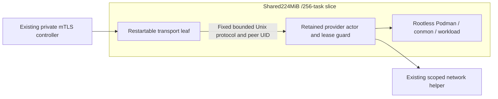

# Restartable transport and retained runtime owner

Source implementation on `story/sandbox-supervisor-layout`, based on
`ea2297432cf8023f2c7123d4196fc8a2d3be2bd5`, isolated from the deployed source416
and integration worktree. No live redesign has been applied.

The current worker combines CP polling, provider effects and expiry fencing.
Its retained delegated cgroup prevents systemd259 from restarting its main
executor, and worker exit also removes the expiry loop. Separate responsibilities
using two fixed unprivileged services and the existing local worker protocol.

Transport owns only mTLS polling and durable command/reply handling. It forwards
the original command version and generation to the fixed UID-pinned actor
socket. It loads no provider, bootstrap transport or private probe identity.
The actor owns the existing provider/files/network implementation, immutable
authorization pin and lease, and an expiry loop independent of transport
liveness. An opaque actor-owned lease token supplies a UUID-derived parent
inside its exact delegated subtree; there is no cross-ancestor migration,
caller-selected cgroup-parent argument or new root placement RPC. Both
processes remain jointly trusted under the dedicated
OS UID; this is not credential isolation between them.

Use one shared224MiB/256-task parent, preserving the aggregate budget. The
workload remains128MiB/1CPU/64 tasks and existing fixed disk, IO and mount
bounds remain. Transport has no delegation. Actor is delegated with its main
process in a leaf, but `KillMode=control-group` and SIGKILL make actor failure
fail closed for every owned descendant. Restarting transport does not restart,
stop or otherwise couple the actor. Actor restart does not promise retained
execution: its entire old subtree must first be gone.

An explicit operator-only split configuration and role select this layout.
`tnxsandboxqual.slice` holds the aggregate cap; the fixed actor unit is
`tunnex-sandbox-qual-actor.service`, with its main process in `/control`.
Source templates also provide `tunnex-sandbox-qual-transport.service`.
The new layout accepts only existing qualified64-PID profiles. The actor
validates native cgroup v2, the exact nonroot owner, empty domain root,
delegation/common-ancestor write permission, controllers and parent caps.
Legacy defaults remain unchanged and new activation remains unavailable until
the layout is qualified. No router, OpenAPI, policy, account, optional feature
or live configuration change belongs to this story.

## Ownership and stories

| Owner | Source seam and acceptance |
| --- | --- |
| Root | Explicit config/role construction in runtime main, source-only slice/unit templates, integration, validation and fixture packet |
| Unix forwarder worker | New `sandboxes/unix_control_forwarder.go` and tests: original generations, bounded JSON/deadlines, expected binding/probe, socket UID and nested-health concurrency |
| Lease/actor worker | New actor serving/expiry path and narrow existing server seams: immutable lease before authorization, serialized actor effects, independent expiry, stale-start refusal, exact stop even if network withdrawal fails |
| Native fixture worker | New approval-gated systemd259 harness and pure ownership guards: actual EBUSY before, retained execution after transport restarts, independent expiry and actor-failure cleanup |

The actor must validate the old pin, exact identity and immutable lifetime
before persisting authorization. Fixed ping bypasses mutation/expiry locks for
bootstrap health reentrancy. Expiry must stop exact execution even when network
withdrawal fails, confirm stopped before its receipt, and preserve pending
canonical/network cleanup. No address release or Deleted claim follows local
execution fencing alone.

The durable lease precedes guard arming and publication of an execution pin.
The guard uses the original absolute deadline on a timer independent of the
actor effect mutex, transport, provider commands and network cleanup. It writes
freeze then kill through preopened descriptors on the entire UUID parent, and
retains that parent frozen to prevent a delayed start from executing. Resume
advances generation without rebasing the interval or thawing the parent.
Failure to establish or enforce the guard terminates the actor so its manager
kills the complete owned tree. The guarded Podman constructor requires the
opaque token, verifies its configured parent and actual running payload's
`/proc` cgroup membership, and preserves ordinary provider behavior elsewhere.

The qualification actor retains at most256 scope records and frozen UUID
parents during its lifetime. Exhaustion refuses new scopes rather than grow
descriptors/state without a bound. Operator recovery kills any retained payload
before replacing the actor; it is not a payload-preserving restart.

The one-second sweep remains responsible for provider/network bookkeeping and
confirmed execution receipts; it is eventual cleanup, not the independent
execution deadline. A receipt's `StoppedAt` is the sampled sweep time, not a
physical stop timestamp. Kernel freeze and timer scheduling are asynchronous;
native evidence must measure observed deadline lag rather than claim zero
wall-clock skew. Parent freeze/kill fences payload execution; conmon placement,
namespace retirement and canonical network/address cleanup are separate.
No fake provider test qualifies systemd restart or actual Podman launch.

Actor failure kills its descendants and does not promise retained payloads.
Its singleton startup may remove only its own fixed0700-directory/0660 socket
after a bounded connection returns ECONNREFUSED and its inode remains the same.
Live, foreign, non-socket or uncertain endpoints are refused. Listener shutdown
does not unlink by pathname. These checks assume jointly trusted same-UID host
processes; they are not an atomic unlink against an adversarial same-UID binder.

The underlying contracts are documented by the
[kernel cgroup v2 interface](https://docs.kernel.org/admin-guide/cgroup-v2.html),
[systemd259 delegation](https://raw.githubusercontent.com/systemd/systemd/v259/man/systemd.resource-control.xml)
and [Podman's parent placement](https://docs.podman.io/en/latest/markdown/podman-run.1.html).

Implement protocol/config and actor contracts first; then source unit guards
and both-edition tests; then the approved bounded native fixture. That fixture
also runs a pinned compiled test of the actual cgroup guard with synthetic
children, while preserving its separate Podman/VPN qualification boundary.
Keep all other sandbox features frozen. See the exact
[fixture approval packet](../deploy/sandbox/qualification/README.md) and the
[source/native validation results](S-sandbox-supervisor-validation.md).
